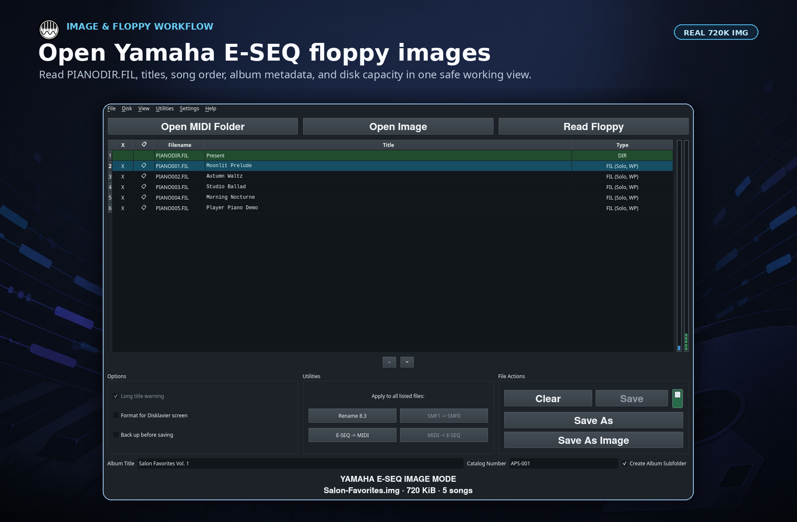
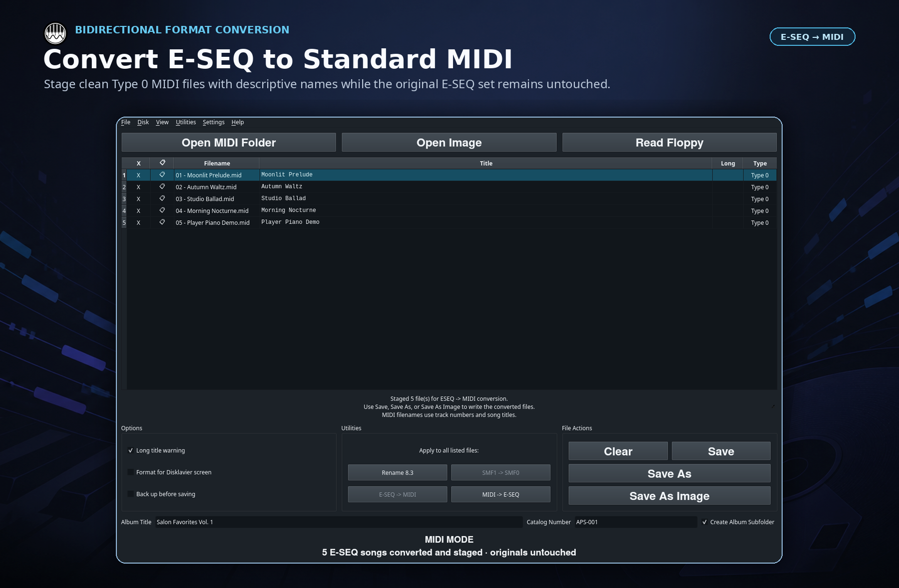
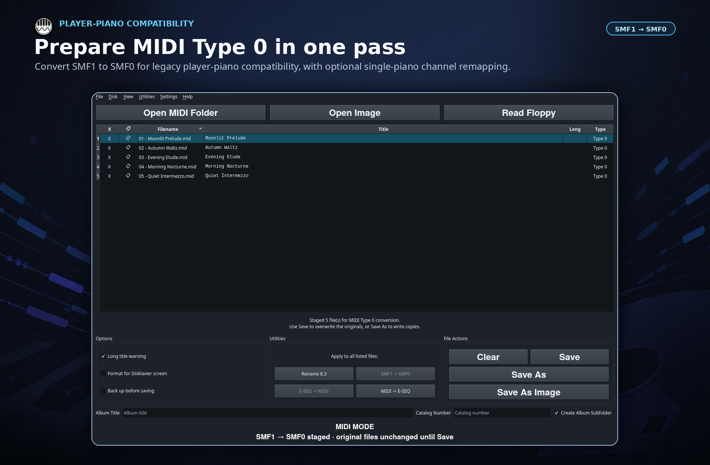
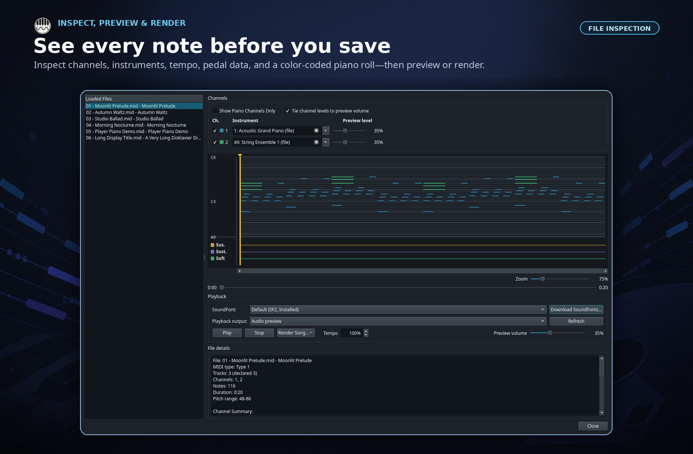
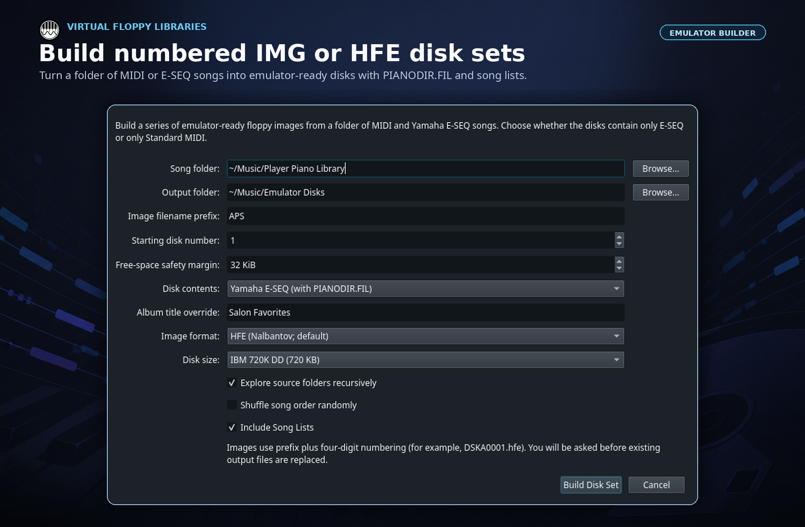

<p align="center">
  <picture>
    <source media="(prefers-color-scheme: dark)" srcset="docs/images/alexs-piano-service-logo-dark.png">
    
  </picture>
</p>

<h1 align="center">APS MIDI Prep Tool</h1>

<p align="center"><strong>Yamaha Disklavier E-SEQ, MIDI, and floppy-image utility</strong></p>

<p align="center">
  Preserve PianoSoft disks, edit song metadata, convert Yamaha E-SEQ and Standard MIDI,
  prepare MIDI Type 0 files, and build virtual floppy libraries in one desktop app.
</p>

<p align="center">
  <a href="https://github.com/Alexs-Piano-Service/aps-midi-prep-tool/releases/latest"><strong>Download the latest release</strong></a>
  · <a href="#quick-start">Quick start</a>
  · <a href="#guides-and-support">Guides</a>
  · <a href="CHANGELOG.md">Changelog</a>
</p>

Current version: `0.8.1`

APS MIDI Prep Tool is a visual Yamaha PianoSoft floppy reader, E-SEQ to MIDI
converter, MIDI title editor, and IMG/HFE disk builder for Disklavier and other
legacy player-piano workflows. Changes are staged for review, so you can inspect
the result before writing a file, disk image, or physical floppy.

## Read Yamaha PianoSoft floppies and disk images

Open common IMG/BIN-style raw images and HFE images, read compatible physical
floppies, or drag MIDI, E-SEQ, and image files directly into the workspace. In
Image Mode, the app shows song titles, playback order, `PIANODIR.FIL` metadata,
disk capacity, and the 60-song Disklavier E-SEQ limit in one place.

[](docs/images/aps-midi-prep-tool-yamaha-eseq-floppy-image-editor.png)

The original image can remain write-protected while you edit titles, rename or
reorder songs, convert formats, and export a clean copy. Physical-media tools can
also create IMG or low-level SCP archives before you make changes.

## Convert Yamaha E-SEQ and MIDI both ways

- Convert Yamaha E-SEQ to Standard MIDI while preserving song titles and order.
- Convert MIDI to E-SEQ and generate compatible `PIANODIR.FIL` or `MUSIC.DIR`
  directory data.
- Convert MIDI Type 1 to Type 0 (SMF1 to SMF0) for legacy player-piano
  compatibility, with optional instrument merging onto one piano channel.
- Stage every conversion first; use **Save**, **Save As**, or **Save As Image**
  only when the list looks right.

<table>
  <tr>
    <td width="50%">
      <a href="docs/images/aps-midi-prep-tool-eseq-to-midi-conversion.png">
        
      </a>
    </td>
    <td width="50%">
      <a href="docs/images/aps-midi-type-1-to-type-0-conversion.png">
        
      </a>
    </td>
  </tr>
  <tr>
    <td><strong>E-SEQ ↔ MIDI</strong><br>Use descriptive filenames and clean title spacing without touching the source set.</td>
    <td><strong>SMF1 → SMF0</strong><br>Prepare single-track MIDI copies for compatible player-piano hardware.</td>
  </tr>
</table>

## Inspect, preview, and render MIDI and E-SEQ

File Inspection turns MIDI or E-SEQ data into a color-coded piano roll with
channel, instrument, tempo, note, and pedal details. Mute channels, adjust the
preview mix and tempo, audition through a SoundFont or USB MIDI device, or render
WAV and MP3 reference audio.

[](docs/images/aps-midi-prep-tool-midi-file-inspection-piano-roll.png)

Collection tools can also correct titles and filenames, create DOS 8.3 names,
strip Yamaha XF data, soften pedal behavior, merge instruments for piano
playback, and process an entire folder at once.

## Build IMG and HFE floppy-emulator disk sets

Turn a folder of MIDI or E-SEQ songs into numbered IMG or HFE images for a
floppy emulator such as Nalbantov. Choose the disk format, reserve a safety
margin, include subfolders, create song lists, and build Yamaha E-SEQ disks with
`PIANODIR.FIL` automatically.

[](docs/images/aps-midi-prep-tool-hfe-emulator-disk-builder.png)

The builder creates the disk images themselves. Keep the setup files from an
existing emulator USB stick and follow the emulator manufacturer's instructions
when preparing replacement media.

<sub>All screenshots show the real application with self-created demonstration files.</sub>

## Quick start

1. Open a MIDI or E-SEQ folder, open a floppy image, or read a physical disk.
2. Review titles, filenames, song order, formats, and compatibility warnings;
   apply only the conversions or cleanup tools you need.
3. Export to a folder, ZIP archive, new IMG/HFE image, or compatible physical
   floppy.

Edits and conversions in the main list remain staged until you save. Formatting
and disk-writing commands require a separate confirmation.

## Supported media and formats

| Source | What APS MIDI Prep Tool can do |
| --- | --- |
| Standard MIDI (`.mid`, `.midi`) | Edit titles and filenames, inspect, preview, batch-process, render, and convert to SMF0 or Yamaha E-SEQ. |
| Yamaha E-SEQ (`.FIL`/`.MDA` with `PIANODIR.FIL`/`MUSIC.DIR`) | Preserve album and song information, edit titles and order, convert to MIDI, and build compatible disks. |
| Physical 3.5-inch floppies | Read, image, recover, format, and write through a compatible floppy drive or Greaseweazle. |
| Floppy images | Open common IMG/BIN-style raw images and HFE images; create IMG/HFE disks and SCP flux captures from physical media. |
| Other legacy music formats | Import or convert supported PianoDisc System 3, Akai MPC, Yamaha V50/SY77, PSR-600, and Electone MDR data. |
| Exports | Save songs to a folder or ZIP, create IMG/HFE disk images, and render MIDI or E-SEQ to WAV or MP3. |

The main editing workflow is designed for Standard MIDI, Yamaha E-SEQ, and
Yamaha-compatible floppy media. Some additional legacy formats are import-only
or read-only conversion sources. Disklavier E-SEQ uses DOS 8.3 filenames,
32-character titles, and no more than 60 cataloged songs per disk.

## Preservation-first safeguards

- Image an irreplaceable floppy before editing it. Recovery mode can retry
  difficult media, while Greaseweazle can identify weak areas and create an SCP
  archive.
- Use **File → Write Protection → Write-Protect Original** to prevent an open
  image or floppy from being overwritten. Copy-based exports remain available.
- Enable optional backups under **File → Save Options**, and always test a newly
  written disk or image before relying on it.
- If your operating system offers to format an old piano disk, cancel that
  prompt and open the disk through APS MIDI Prep Tool instead.

## Download and requirements

[Packaged releases](https://github.com/Alexs-Piano-Service/aps-midi-prep-tool/releases/latest)
are available for Windows and Linux. Running from source requires Python 3.10
or newer and PySide6.

Some workflows use optional tools:

- `mtools` for FAT floppy-image operations, and the Greaseweazle CLI (`gw`) for
  Greaseweazle hardware, HFE conversion, and flux-image workflows.
- FluidSynth plus a compatible SoundFont for SoundFont previews and audio
  rendering, LAME for MP3 encoding, and `python-rtmidi` for direct MIDI-device
  playback. Basic piano preview does not require FluidSynth.
- Operating-system permission to access a physical floppy drive.

Optional-tool availability varies by release package. FluidSynth and a
SoundFont are not bundled by default.

The interface is available in English, Spanish, French, German, Italian,
Brazilian Portuguese, Bulgarian, Dutch, Polish, Japanese, Korean, and
Simplified Chinese.

## Run from source

On Linux:

```bash
python3 -m venv .venv
source .venv/bin/activate
pip install PySide6
python3 aps_midi_prep_tool.py
```

See [CONTRIBUTING.md](CONTRIBUTING.md) for development setup and test commands.

## Guides and support

- [Convert MIDI files and create PIANODIR.FIL](https://www.alexanderpeppe.com/eseq-and-pianodir-fil/)
- [Extract MIDI files from a Yamaha floppy disk](https://www.alexanderpeppe.com/extracting-midi-files-from-a-yamaha-floppy-disk-with-aps-midi-prep-tool/)
- [Change MIDI titles on your computer](https://www.alexanderpeppe.com/change-midi-titles-aps-midi-prep-tool/)
- [Copy a Yamaha PianoSoft floppy to a Nalbantov USB stick](https://www.alexanderpeppe.com/copying-a-yamaha-pianosoft-floppy-disk-to-a-nalbantov-usb-stick/)
- [Convert MIDI files from Type 1 to Type 0](https://www.alexanderpeppe.com/converting-midi-files-type-1-to-type-0-aps-midi-prep-tool/)
- [Edit titles and songs in Nalbantov virtual disks](https://www.alexanderpeppe.com/adding-removing-or-changing-titles-in-nalbantov-usb-stick-virtual-disks/)

Use **Help → Send Feedback...** or **Help → Report a Bug...** inside the app for
support. See [CHANGELOG.md](CHANGELOG.md) for release history and
[SECURITY.md](SECURITY.md) for responsible reporting guidance.

## License and responsible use

Copyright © 2026 Alex's Piano Service LLC. APS MIDI Prep Tool is released under
the [Apache License 2.0](LICENSE).

Use the tool only with disks and files you own or are authorized to preserve,
convert, or modify. Keep backups and test outputs before relying on them. The
project is an independent compatibility utility and is not affiliated with or
endorsed by Yamaha, Disklavier, PianoSoft, PianoDisc, Nalbantov, Greaseweazle,
Akai, or other companies and products named for compatibility purposes.

[Disclaimer](https://www.alexanderpeppe.com/disclaimer/) ·
[Privacy Policy](https://www.alexanderpeppe.com/privacy-policy/) ·
[DMCA Policy](https://www.alexanderpeppe.com/dmca-policy/)
